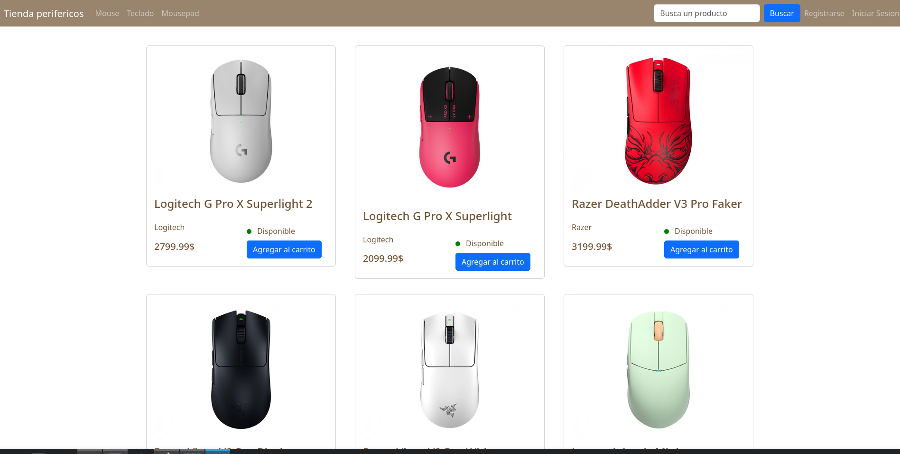
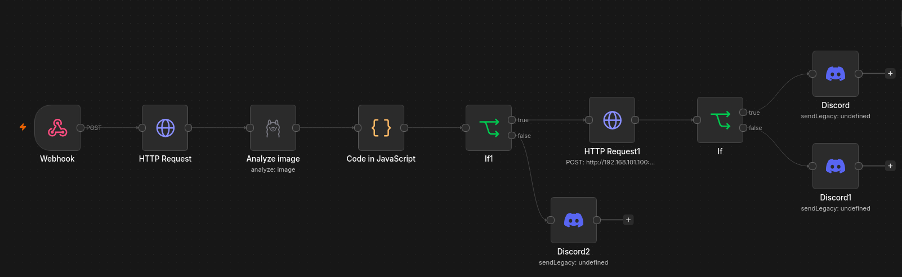
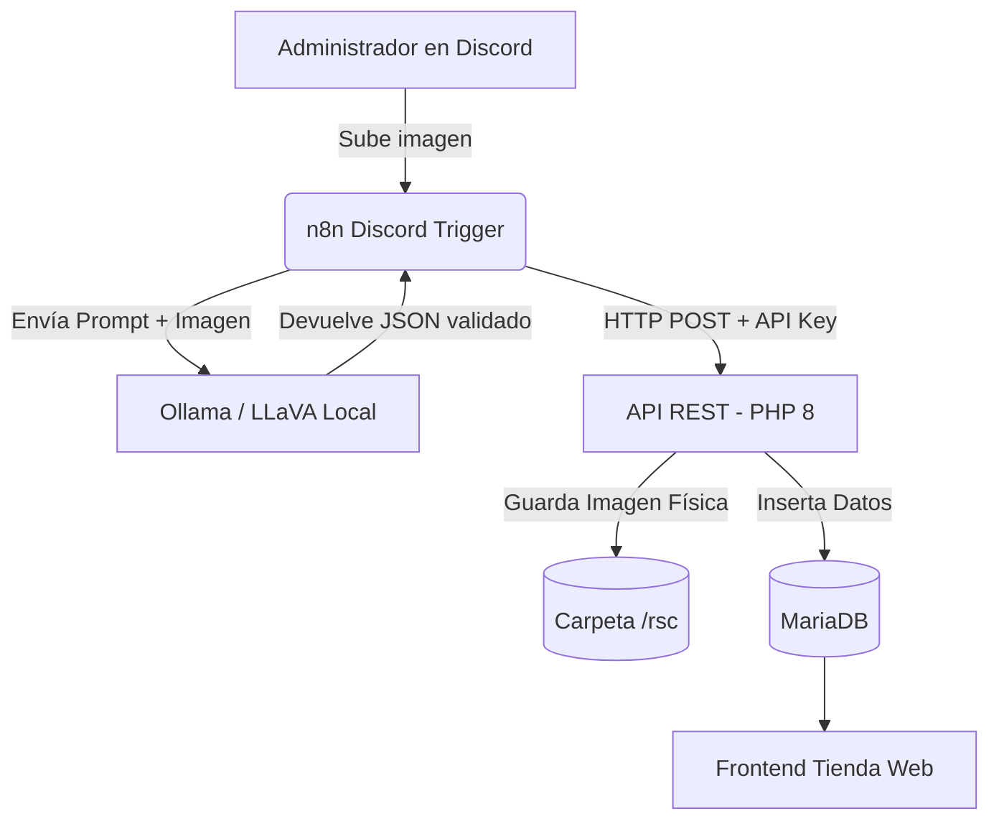
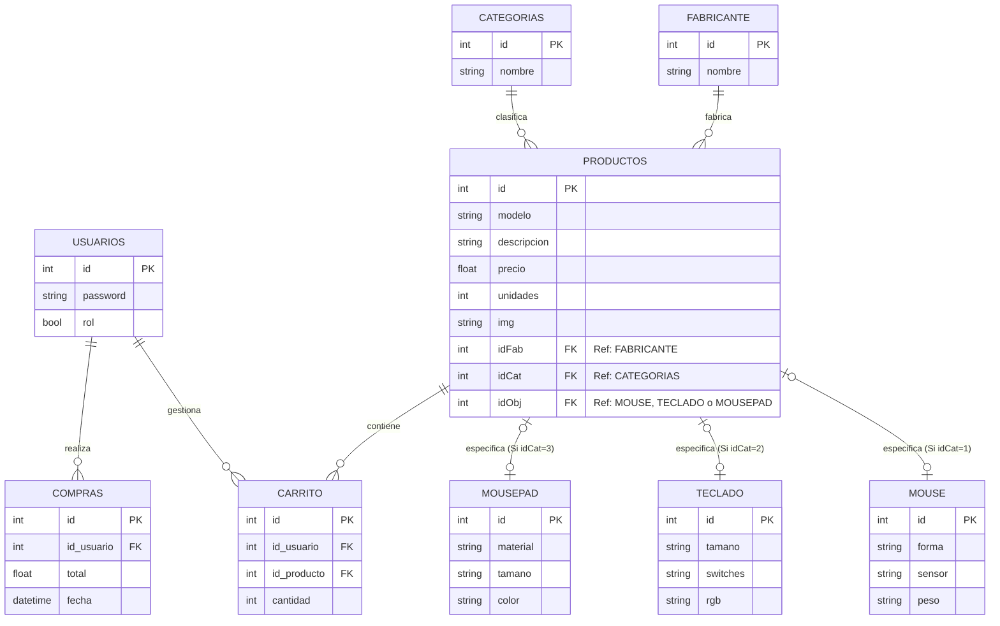

# Ecosistema Distribuido: Tienda de Periféricos & Pipeline de Automatización

Un sistema de comercio electrónico web especializado en la venta de periféricos de computadora (mouses, teclados y mousepads), ampliado con un pipeline de automatización de inventario impulsado por IA local. El proyecto está completamente contenedorizado con Docker para facilitar su despliegue en cualquier entorno y demuestra una arquitectura desacoplada orientada a eventos.

- - - 



## Arquitectura del Sistema

El proyecto opera como un "monorepo" que integra la tienda con un flujo de ingesta automatizada de datos:
1. **Ingesta (Discord + n8n):** Un webhook en Discord captura imágenes enviadas por el administrador y dispara un flujo de orquestación en n8n.
2. **Visión Artificial con LLM local (Ollama):** n8n envía la imagen a un modelo local de ollama (Gemma4:4eb) (ejecutándose directamente en la máquina host para aprovechar la aceleración por hardware nativa en GPUs) para extraer y estructurar especificaciones técnicas en un esquema JSON estricto.
3. **API RESTful (PHP):** Un endpoint seguro (`/api-core`) recibe el JSON, valida la autorización mediante una llave de acceso (`x-api-key`), procesa la descarga del binario de la imagen y persiste los datos.
4. **Presentación (Frontend):** La tienda web consume la base de datos para mostrar el catálogo actualizado instantáneamente.




- - -

# Estructura del Proyecto

El código está organizado bajo el principio de separación de responsabilidades:

```bash
    ├── /api-core           # Controladores de backend y endpoints RESTful de ingesta
    ├── /automation         # codigo node.js del bot de discord y flujos exportados de n8n (.json) para el bot.
    ├── /infrastructure     # Scripts SQL de inicialización (db.sql) y de pruebas (seed.sql)
    ├── /frontend           # Interfaz de usuario de la tienda y vistas HTML/PHP
    │   └── /rsc            # Directorio de recursos y almacenamiento de imágenes
    ├── docker-compose.yml  # Orquestación de infraestructura (Apache/PHP, MariaDB, n8n)
    └── README.md
```

- - -

# Características Principales

* **Pipeline Automatizado con IA:** Integración de n8n con modelo local para la identificación, categorización y registro automático de inventario a partir de fotografías.

* **API Segura:** Endpoint en PHP que gestiona inserciones complejas (creación dinámica de fabricantes), sanitización de datos y descarga controlada de archivos en contenedores.

* **Base de Datos Normalizada:** Estructura relacional optimizada con tablas específicas para fabricantes, categorías y especificaciones técnicas por tipo de periférico.

### Diagrama Entidad-Relación (ER)



* **Seguridad y Autenticación:** Contraseñas cifradas con Bcrypt (password_hash / password_verify) y control de sesiones robusto con protección contra ejecución prematura de cabeceras.

* **Gestión de Carrito y Pedidos:** Añadir, actualizar unidades y eliminar productos del carrito de compras. Validación en tiempo real de stock disponible y transacción automatizada al realizar el pedido (descuento automático de stock y limpieza de carrito).

* **Panel de Administración:** Gestión completa para insertar, actualizar y eliminar productos y fabricantes.

- - -

# Stack Tecnológico

 * **Backend & API:** PHP 8.2 (con extensiones MySQLi).

 * **Automatización & Visión:** n8n (Dockerizado) y Ollama.

 * **Base de Datos:** MariaDB 10.11.

 * **Servidor Web:** Apache.

 * **Despliegue:** Docker & Docker Compose.

 * **Frontend:** Bootstrap 5.3, HTML5, CSS3, JavaScript.

- - - 

# Instalación y Despliegue Local

La forma más sencilla de levantar el proyecto es utilizando Docker. No es necesario instalar PHP ni MariaDB en tu máquina local.

**1. Clonar el repositorio:**

```Bash

    git clone https://github.com/1Imaginal/tiendaperifericos
    cd tiendaperifericos
```


**2. Configurar el modelo de IA Local (Host):**

* Instala Ollama nativamente en tu sistema.

* Descarga e inicia el modelo de visión ejecutando: ollama run gemma4:4eb (u otro modelo con capacidad de analizar imagenes)

**3. Levantar los contenedores (PHP, MariaDB, n8n):**

Ejecuta el siguiente comando en la raíz del proyecto. Esto descargará las imágenes necesarias, construirá el servidor web y ejecutará el script db.sql automáticamente.
```Bash

    docker-compose up --build -d
```

**4. Inyectar la base de datos de prueba (Opcional):**

Puedes poblar los datos iniciales (usuarios con contraseña cifrada, fabricantes, productos) ejecutando:
```Bash

docker-compose exec -T db mariadb -u root -padmin_perifericos tienda_perifericos < infrastructure/seed.sql
```

** 5. Configurar la Automatización:**

* Accede a la instancia de orquestación en http://localhost:5678.

* Importa el flujo desde /automation/discord_vision_pipeline.json.

* Asigna tus credenciales del webhook de Discord y la x-api-key en el nodo de HTTP Request.

    
**6. Acceder a la aplicación:**

Abre tu navegador web y navega a: http://localhost:8080

- - -

# Credenciales y Variables de Entorno

Por defecto, la base de datos de Docker se configura con las siguientes variables:

* Host: db

* Puerto Externo: 3307

* Base de Datos: tienda_perifericos

## Cuentas Precargadas (Seed):

* **Administrador:** admin / admin123

* **Cliente de prueba 1:** test-user-1 / test1234

* **Cliente de prueba 2:** test-user- / test1234

- - -

# Gestión de Archivos

Las imágenes de los productos subidas desde el panel de administrador o capturadas por el bot de automatización se guardan automáticamente en la ruta /frontend/rsc/productos/. El volumen de Docker está configurado para reflejar y persistir estos cambios instantáneamente en el disco local. 
